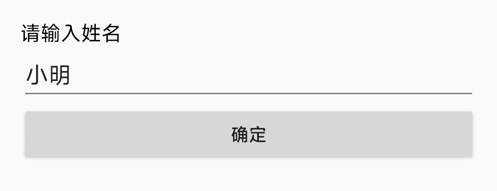

# 输入框控件: input

输入框控件也是一个特殊的文本控件，因此所有文本控件的函数的属性和函数都适用于按钮控件。输入框控件有自己的属性和函数，要查看所有这些内容，阅读[EditText](http://www.zhdoc.net/android/reference/android/widget/EditText.html)。

对于一个输入框控件，我们可以通过 text 属性设置他的内容，通过 lines 属性指定输入框的行数；在代码中通过`getText()`函数获取输入的内容。例如：

```
"ui";
ui.layout(
    <vertical padding="16">
        <text textSize="16sp" textColor="black" text="请输入姓名"/>
        <input id="name" text="小明"/>
        <button id="ok" text="确定"/>
    </vertical>
);
//指定确定按钮点击时要执行的动作
ui.ok.click(function(){
    //通过getText()获取输入的内容
    var name = ui.name.getText();
    toast(name + "您好!");
});
```

效果如图：



除此之外，输入框控件有另外一些主要属性(虽然这些属性对于文本控件也是可用的但一般只用于输入框控件)：

## hint

输入提示。这个提示会在输入框为空的时候显示出来。如图所示:


上面图片效果的代码为：

```
"ui";
ui.layout(
    <vertical>
        <input hint="请输入姓名"/>
    </vertical>
)
```

## textColorHint

指定输入提示的字体颜色。

## textSizeHint

指定输入提示的字体大小。

## inputType

指定输入框可以输入的文本类型。可选的值为以下值及其用"|"的组合:

-   `date` 用于输入日期。
-   `datetime` 用于输入日期和时间。
-   `none` 没有内容类型。此输入框不可编辑。
-   `number` 仅可输入数字。
-   `numberDecimal` 可以与 number 和它的其他选项组合，以允许输入十进制数(包括小数)。
-   `numberPassword` 仅可输入数字密码。
-   `numberSigned` 可以与 number 和它的其他选项组合，以允许输入有符号的数。
-   `phone` 用于输入一个电话号码。
-   `text` 只是普通文本。
-   `textAutoComplete` 可以与 text 和它的其他选项结合, 以指定此字段将做自己的自动完成, 并适当地与输入法交互。
-   `textAutoCorrect` 可以与 text 和它的其他选项结合, 以请求自动文本输入纠错。
-   `textCapCharacters` 可以与 text 和它的其他选项结合, 以请求大写所有字符。
-   `textCapSentences` 可以与 text 和它的其他选项结合, 以请求大写每个句子里面的第一个字符。
-   `textCapWords` 可以与 text 和它的其他选项结合, 以请求大写每个单词里面的第一个字符。
-   `textEmailAddress` 用于输入一个电子邮件地址。
-   `textEmailSubject` 用于输入电子邮件的主题。
-   `textImeMultiLine` 可以与 text 和它的其他选项结合，以指示虽然常规文本视图不应为多行, 但如果可以, 则 IME 应提供多行支持。
-   `textLongMessage` 用于输入长消息的内容。
-   `textMultiLine` 可以与 text 和它的其他选项结合, 以便在该字段中允许多行文本。如果未设置此标志, 则文本字段将被限制为单行。
-   `textNoSuggestions` 可以与 text 及它的其他选项结合, 以指示输入法不应显示任何基于字典的单词建议。
-   `textPassword` 用于输入密码。
-   `textPersonName` 用于输入人名。
-   `textPhonetic` 用于输入拼音发音的文本, 如联系人条目中的拼音名称字段。
-   `textPostalAddress` 用于输入邮寄地址。
-   `textShortMessage` 用于输入短的消息内容。
-   `textUri` 用于输入一个 URI。
-   `textVisiblePassword` 用于输入可见的密码。
-   `textWebEditText` 用于输入在 web 表单中的文本。
-   `textWebEmailAddress` 用于在 web 表单里输入一个电子邮件地址。
-   `textWebPassword` 用于在 web 表单里输入一个密码。
-   `time` 用于输入时间。

例如，想指定一个输入框的输入类型为小数数字，为: `<input inputType="number|numberDecimal"/>`

## password

指定输入框输入框是否为密码输入框。默认为`false`。

例如：`<input password="true"/>`

## numeric

指定输入框输入框是否为数字输入框。默认为`false`。

例如：`<input numeric="true"/>`

## phoneNumber

指定输入框输入框是否为电话号码输入框。默认为`false`。

例如：`<input phoneNumber="true"/>`

## digits

指定输入框可以输入的字符。例如，要指定输入框只能输入"1234567890+-"，为`<input digits="1234567890+-"/>`。

## singleLine

指定输入框是否为单行输入框。默认为`false`。您也可以通过`lines="1"`来指定单行输入框。

例如：`<input singleLine="true"/>`
